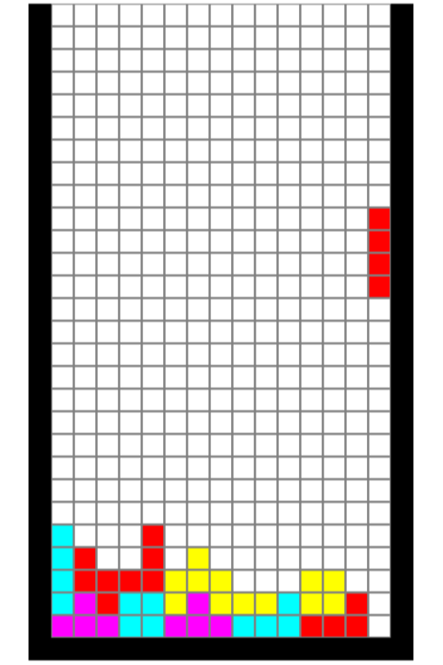

# Tetris Project
TETRIS game - Student project 

This project was realized within the framework of the teaching unit Complementary programming proposed to the students of 1st year of Licence Informatique at the Faculty of Sciences of the University of Poitiers.

## Table of Contents

- [Tetris Project](#tetris-project)
  - [Table of Contents](#table-of-contents)
  - [Information](#information)
  - [Presentation of the project](#presentation-of-the-project)
  - [Screenshots](#screenshots)
  - [Updates](#updates)
    - [Game Over Screen Implementation (11/07/2025)](#game-over-screen-implementation-11072025)
      - [Fixed Issues](#fixed-issues)
    - [Complete Tetris Shapes Implementation (09/03/2024)](#complete-tetris-shapes-implementation-09032024)
      - [Fixed Issues](#fixed-issues-1)
  - [How to play?](#how-to-play)
  - [The controls (AZERTY)](#the-controls-azerty)
    - [To change the keys ?](#to-change-the-keys-)
    - [To change the background color ?](#to-change-the-background-color-)

## Information

- LANGUAGE : OCAML
- VERSION : 22W17C
- GROUP : Radiator
- STUDENTS : Ronan PLUTA FONTAINE | Lucas V.
- YEAR : 2022

## Presentation of the project

We were asked to work in groups and to create a software using our knowledge acquired so far. It is a video game inspired by Tetris. Tetris is a puzzle game designed by Alekseï PAJITNOV in 1984. The goal is to align different shapes in order to complete lines and thus have the best score. With 496.4 million sales worldwide, Tetris is the second best-selling license in history.

## Screenshots

**Gameplay** &nbsp;&nbsp;&nbsp;&nbsp;&nbsp;&nbsp;&nbsp;&nbsp;&nbsp;&nbsp;&nbsp;&nbsp;&nbsp;&nbsp;&nbsp;&nbsp;&nbsp;&nbsp;&nbsp;&nbsp;&nbsp;&nbsp;&nbsp;&nbsp;&nbsp;&nbsp;&nbsp;&nbsp; **Game Over Screen**

 &nbsp;&nbsp; 

## Updates

### Game Over Screen Implementation (11/07/2025)
- **When the player has lost**: Red "GAME OVER" text with yellow score display
- **Simple exit method**: Close the graphics window to exit the game

#### Fixed Issues
- Type error resolved in a getter function

### Complete Tetris Shapes Implementation (09/03/2024)
The game now includes all 7 standard Tetris pieces with proper rotations:

- **I-piece**: Line piece (horizontal ↔ vertical)
- **O-piece**: Square piece (no rotation)
- **T-piece**: T-shaped piece (4 rotations) *new*
- **S-piece**: S-shaped piece (2 rotations) *new*
- **Z-piece**: Z-shaped piece (2 rotations) *new*
- **J-piece**: J-shaped piece (4 rotations) *new*
- **L-piece**: L-shaped piece (4 rotations) *new*

#### Fixed Issues
- Corrected rotation mechanics for all pieces
- Fixed shape transformations during rotations
- Added proper rotation cycles
- Resolved type errors in getter functions

## How to play?

To launch the Tetris game, you just have to use a compiler compatible with OCAML.

If you don't have an OCAML compatible compiler, I suggest you to use **emacs**1 (provided in the project folder) : 
1. Open emacs
2. In the "file" menu, click on "Open File...", then select the "game_tetris.ml" file
3. Compile the program with the following manipulation : ctrl + c, ctrl + b and Enter

## The controls (AZERTY)

- Right : Q
- Left: D
- Right rotation : Z
- Left rotation : S
- As low as possible: A 

### To change the keys ? 
Go to the "move" function and change only the corresponding letters. 

### To change the background color ? 
Go to the function "init_param" and modify the attribute background_color

 
1 Official site (emacs) : <a>https://www.gnu.org/software/emacs/<a>

## Licence

Academic project - Université de Poitiers (2022)
